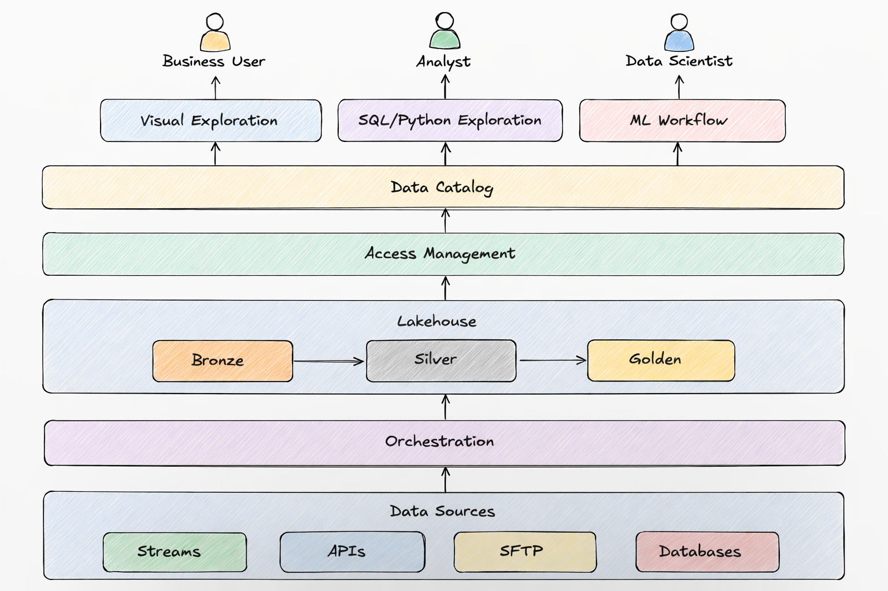

# Features

You can skip to the Summary.

### Pipelines

- **Ingestion**: Ability to implement any source and destination
- **Transformation**:
  - Ability to transform data in ANSI SQL and Python
  - Python transformations should be able to run on a cluster either as distributed dataframes or concurrent batches
- Ability to build a pipeline using AI

### Orchestration of Schedules and Dependencies

- Ability to assign at least one schedule to a pipeline
- Ability to implement custom dependency logic
- Ability to allocate resources (CPUs, memory) per pipeline or groups of pipelines
- Ability to scale up/down automatically and programmatically
- Ability to prioritize a pipeline or groups of pipelines
- Ability to test downstream effects of a change
- Ability to build and test using AI

### Query Engine

- ANSI SQL support
- Custom functions in:
  - Python (ease of use)
  - Dynamically compiled language (performance)
- Ability to scale up/down automatically and programmatically
- Multitenancy support

### Data Catalog

- Table & column descriptions and ownership (technical + content owners)
- Lineage tracking
- Automatic metadata generation:
  - Last refresh time
  - Usual refresh cadence
  - Rich data types (e.g., "addresses" instead of just "string")
  - Data shape / profile
- Strong search capabilities
- Ability to start exploring data directly from search results

### Data Exploration

- Support for exploration using SQL, Python, and AI
- Ability to deploy an exploration to production as:
  - A scheduled / dependent job, or
  - An end product for end users

### Data Science Environment

- Full environment for development, deployment, and monitoring
- Includes a **Feature Store**
- Ability to run multiple alternatives (trainings) concurrently and track them
- Ability to scale up/down automatically and programmatically
- Ability to allocate resources (CPUs, memory)
- Model deployment for inference:
  - Monitor models in production
  - Alert on issues
- Integrated AI assistance for development, testing, and monitoring

### Data Visualization

- Visualize data using SQL, Python, AI, and visual components

### Monitoring

Applicable to all components individually as well as centrally/globally.

- **Scheduling**: Identify when a run is late and whether it finishes on time; ability to implement custom logic
- **Failures**: Ability to implement custom retry logic
- **Data Availability**: Detect late/missing/reduced data volume; implement custom handling per source
- **Data Quality**:
  - Automatic statistical shape/profile checks (noted uncertainty about full feasibility)
  - Ability to implement custom data quality checks
- **Resource Monitoring**: Track usage and implement custom scaling logic
- **Alerting**: Trigger only after automated solutions have failed or time thresholds are exceeded
- **PII**: whether data contains PII

Any element of the platform that can be hacked from outside, from within the code and by the users must be monitored.

### Access Management

- Each component should support user grouping and granular access control

### Backup and Restore

- Ability to define which data and code should be backed up
- Ability to go back in time (may be cost-intensive)
- Ability to backfill from source systems or backups
- Runbooks + regular drills

### Technical Requirements

- Everything defined as **Infrastructure as Code (IaC)**
- Easily searchable and traceable logging
- Full API access for every technology in the stack
- Programmatic access to secured secrets

### Testing

- ability to test downstream effect of a change before submitting code for review, in addition to all the usual ways of testing software and data.

### Participants

A platform should support multiple types of users. Every company names them differently. I will give an example naming in the brackets.

- Creators of the platform (data platform engineers)
- Users who will participate in the development of the platform (data engineers)
- Users who will build pipelines (analytics engineers)
- Users who will explore data using Python (analytics engineers, data scientists)
- Users who will explore data using SQL (analysts)
- Users who will explore data using visual tools (business users)
- Legal team to help classify the data and access
- Security team to help monitor data security and access

### Processes

The following processes should be established
- development of the platform from idea to deployment. In addition to the technical aspects such as code style and structure, documentation, testing, review, deployment, monitoring, performance, resilience, scale, disaster recovery but also cost and security.
- monitoring the platform and addressing production issues
- process for users who want to participate in the development of the platform and thus a process for each type of users
- processes to support each type of users
- data participants who are part of a single data organization there should be an established process for hiring and development for each type of data participant including not only purely professional aspects but also how people interact with each other to make the environment supportive and cooperative

#### Governance and Security

- process and tools for establishing and enforcing the data standards such as naming of databases, tables, columns
- process for classifying data, where each tier is stored and who can have, approve, provide and monitor access

Each process should have the corresponding tooling and documentation.

IMPORTANT: process is a means, not the goal. Processes should be reviewed and adjusted.

#### Disaster Recovery

- Backing up of data at all tiers should be a part of the platform. It should be a flag because in practice not everything needs to be backed up.
- Everything should be easy to deploy and roll back, ideally in at least 2 data centers (regions).

## Technical requirements

There are 2 ways to build a platform:
- compose a platform on a cloud using the cloud's services with additional free and commercial products. The advantage is that it will be modular and cheaper. The disadvantage is that you'll need a good and expensive team and time to develop and maintain it.
- use an expensive commercial product as the core with additional commercial services around it. The advantage is that it will be quicker to start and easier to use. The disadvantage is that it will be more expensive, won't handle everything and you will need to give up some use cases or develop solutions eventually leading to composing a platform.

I'll cover both cases.

### Modular

Based on a cloud with cross cloud and free open source technologies. You can also use cloud versions of the same technologies.

- **communication:** Slack or self hosted Mattermost
- **version control:** GitHub is the default unless you have reasons to prefer other git providers or alternatives.
- **IaC:** I prefer Pulumi's programmability over Terraform
- **OS:** your development, testing and production environments should be the same. Most likely you'll use docker with some Linux flavor. I prefer Ubuntu because it is stable and convenient.
- **shell languge:** zsh has more programming and interactive features and is the standard on Mac.
- **programming language:** Python is the language of data. Use type annotations with a linter. Since version 3.12 it can even run OS threads in parallel using `interpreters` module. But it is relatively slow even when using modules implemented in C. Nevertheless usually multi-step pipelines that pipe large amounts of data lose performance in other places. If you do need speed, consider Spark because it runs on JVM's JIT.
- **coding** environment should give you the choice of multiple AI models/agents. Use the cheapest and quick for most tasks + the most expensive and slow for complex tasks.
- **cloud:** AWS is the oldest and mostly used. Google and Azure may be good due to the ecosystem of their tools with integrated 'AI'. 
- **execution envoronment:** k8s. Each cloud has its implementation. I'd use Docker Desktop with `kind` for local development. For monitoring you can install Fluent Bit with Elastic Search and Kibana. Your cloud likely offers an Elastic Search service.
- **secrets**: if you want to go cross cloud, use Infisical
- **CICD:** if you use GitHUb, use GitHub Action Runners.
- **orchestration:** Dagster. The alternative Airflow and Prefect are catching up for data. Do your research. They have paid cloud versions.
- **ingestion**: Airbyte
- **query engine:** depends on the cloud. Trino is cross cloud but you are responsible for it. Trino exists in AWS as Athena. Starburst is a paid Trino and has additional features.
- **ML**: if you choose Spark/Flink/Dask, keep in mind that not every ML algorithm is parallelizeable. For serving models through APIs, you can save a model as ONNX, code the API in Go to handle spikes + use your cloud's load balancer and registry. Consider Hopsworks as a complete ML environment.
- **data exploration tools** depend on your data scientists and the cloud. I have found Jupyter Hub deployed into my cloud account useful because your code can keep running, use more resources and data loads faster, especially combined with Dask or Spark.
- **data catalog + visualization** depend on the cloud. For AWS it is better to use your own or paid DataHub + Metabase / Sigma Computing / ThoughtSpot

### Quick, easy and expensive

Build your platform around Snowflake because it is not only a query engine, it is also a development environment, a code execution environment, it has built in orchestration, it has a data catalog, built-in AI assistance. 
Nevertheless in addition to Snowflake you'll need a cloud with some of the types of technologies mentioned above.

